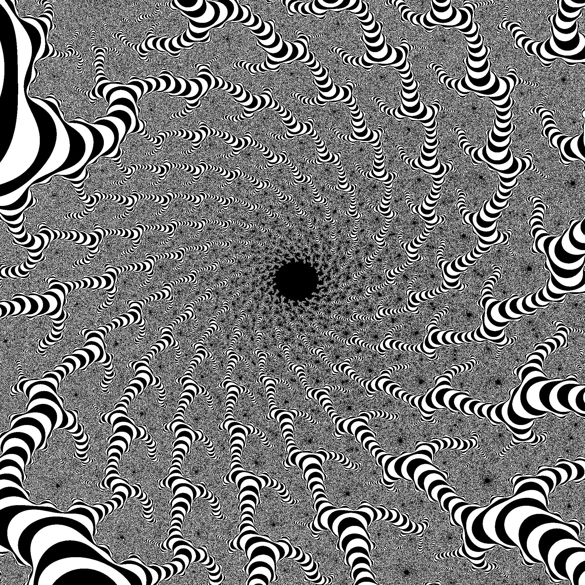

# What
This code renders images of the Mandelbrot set with multiple threads, like:



(This image was made using the coordinates found in
[this ancient screenshot](http://www.math.utah.edu/~alfeld/math/mandelbrot/all.gif)!
Check out that DE. 😍 That's from [this wonderful page](http://www.math.utah.edu/~alfeld/math/mandelbrot/mandelbrot.html).)

# *What?*
The [Mandelbrot set](https://en.wikipedia.org/wiki/Mandelbrot_set) is the set
of complex numbers `c` for which `z` does not fly out to infinity (and instead
circles around the origin) when calculating `z = z * z + c` in an infinite loop.
Less-than-infinite iterations yield less-than-exact approximations of the set,
with more iterations yielding more accurate approximations.

An image of the set is made by treating each pixel of the image as
a point on the complex plane and seeing whether that point is in the set.
If it's in the set, it's colored black; if it escapes the set, it's colored
based on how long it took to escape.

# How
Download the code and run:

```cargo run frac.png 2000x2000 -0.245178,-0.650185 -0.244486,-0.649417 250```

The image `frac.png` will be written to the current directory.

The input uses two complex numbers (above, `-0.245178,-0.650185` and
`-0.244486,-0.649417`) as the upper left and lower right corners, respectively,
on the complex plane to define the region of the complex plane to be rendered.

For more info on the input, see the usage text by just running `cargo run`.

The image's pixels are split across some number of threads, and each thread renders its part of the image, in "[fork-join parallelism](https://en.wikipedia.org/wiki/Fork%E2%80%93join_model)" fashion.

# License
[MIT](https://opensource.org/licenses/MIT)